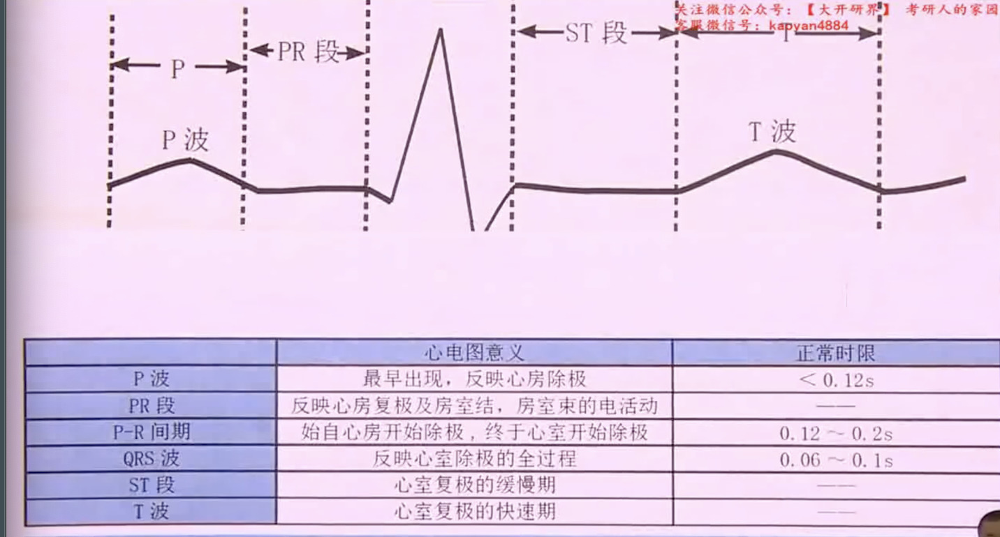

# 心律失常

- 
- [[窦性心律失常]]
- [[房性心律失常]]
- [[房室交界区性心律失常]]
- [[室性心律失常]] 
- [[心脏传导阻滞]]
- [[抗心律失常药物的合理应用]]
- [[心脏电复律]]
- [[导管射频消融]]
## 病因

### 先天遗传性

### 器质性

## 分类

### 冲动形成异常

#### 窦性心律失常

- 窦性心动过速
- 窦性心动过缓
- 窦性心律失常
- 窦性停搏

#### 异位心律

- 被动性异位心律
  - 逸搏与逸搏心律(窦房结频率降低)
- 主动性异位心律
  - 期前收缩
  - 阵发性心动过速与非阵发性心动过速
  - 心房扑动,心房颤动
  - 心室扑动,心室颤动

### 冲动传导异常

## 发生机制

### 冲动形成异常

### 冲动传导异常

## 诊断

- 首选心电图
- 阵发性选动态心电图

