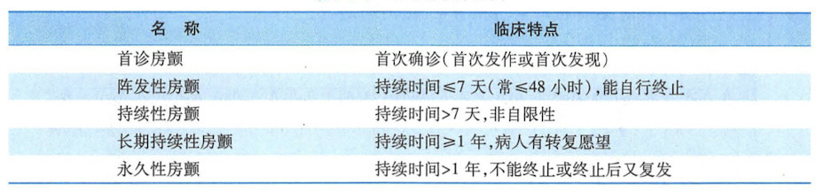
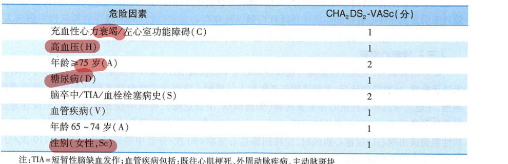

# 心房颤动

## 分类

## 临床表现

- 心室舒张末期血量减少 25%
- 无第四心音
- 容易形成血栓,栓塞最多见与严重的部位在脑
- ==第一心音强弱不等,心律极不规则,脉搏短绌==

## 心电图

- P 波消失代之以小而不规则的基线搏动.形态与振幅变化不定,称为小 f 波,频率为 350~600 次/分
- 心室率极不规则
- QRS 波形态通常正常

## 诊断

- 小 f 波(不规则)+第一心音强弱不等,心律绝对不齐,脉搏短绌->房颤

## 治疗

- 心衰加房颤首选洋地黄
- 预激综合征+房颤 胺碘酮
- 其他心律失常除房颤外用胺碘酮

## 抗凝治疗

- 合并症,一个 75 岁高血压糖尿病心衰的女人

  - 

- 房颤持续不超过 24 小时，复律前无需作抗凝治疗。 否则应在复律前接受华法林有效抗凝治疗 3 周，

## 转复并维持窦性心律

- 胺碘酮

## 控制心室率
